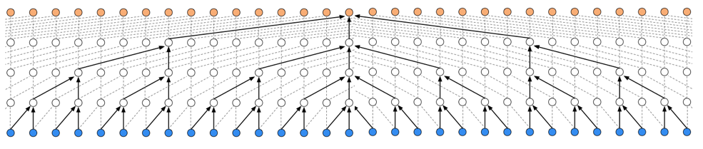

# wavenet

## Description
  * This is a Tensorflow implementaion of Audio source separation (mixture to vocal) using the Wavenet. Although the Wavenet model used the causal convolution (only previous sequence must be used for training) to generate(predict) next sequence, this task is for audio separation purposes, so the latter sequence may be used for training. I used original dilated 1-D convolution. Except this, the network structures are the same as the [paper](https://deepmind.com/blog/wavenet-generative-model-raw-audio/). See the file `hyperparams.py` for the detailed hyperparameters.

## Requirements
  * NumPy >= 1.11.1
  * TensorFlow >= 1.0.0
  * librosa

## Data
I used DSD100 dataset which consists of pairs of mixture audio files and vocal audio files. The complete dataset (~14 GB) can be downloaded [here](http://liutkus.net/DSD100.zip). The data was pre-processed with sample_rate=16000, and was divided into 380ms units. Therefore, the number of timesteps for network input was then 6080 raw data.

## File description
  * `hyperparams.py` includes all hyper parameters that are needed.
  * `data_utils.py` loads training data and preprocess it into units of raw data sequences.
  * `modules.py` contains all methods, building blocks and skip connections for networks.
  * `networks.py` builds networks.
  * `train.py` is for training.
  * `eval.py` is for generating separated vocal sample.

## Training the network
  * STEP 1. Adjust hyper parameters in `hyperparams.py` if necessary.
  * STEP 2. Download and extract DSD100 data as mentioned above at 'data' directory.
  * STEP 3. Run `train.py`. 

## Generate seperated vocal audio
  * Prepare a test data (the name of this data should be defined at hyperparams.py) and locate it in 'data' directory and run `eval.py`.

## Notes
  * I applied L1-loss instead of NLL-loss using the mu-law companding.